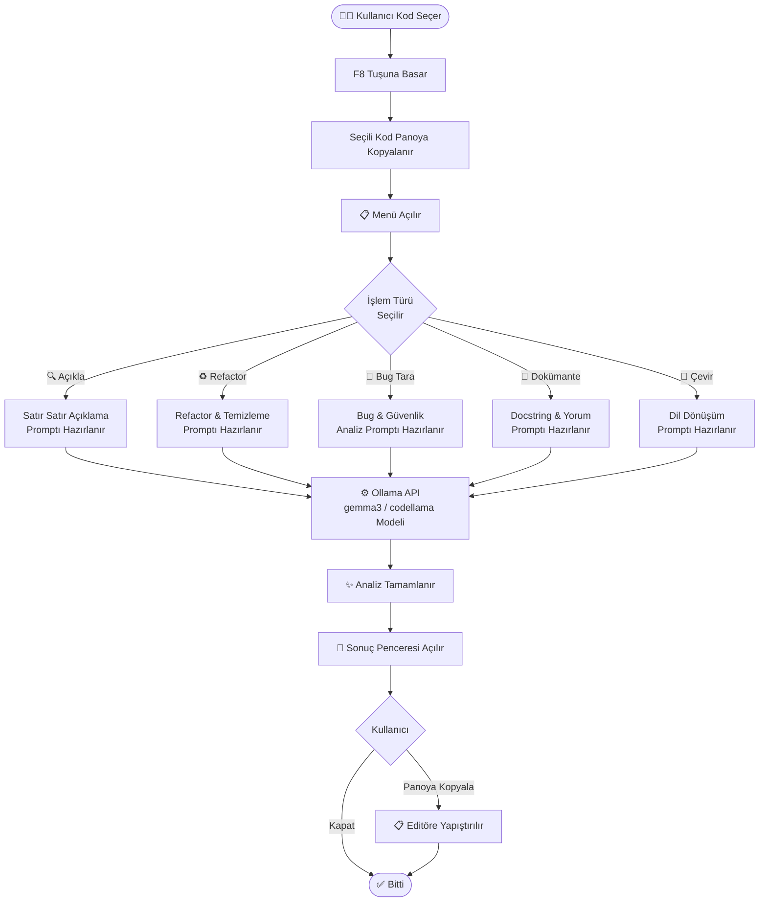

# 🧠 Kod Açıklama & Refactor Asistanı

<div align="center">

### Herhangi bir editörde kod seç → F8'e bas → Anında analiz et

[](https://www.python.org/downloads/)
[](https://docs.ollama.com/quickstart)
[](https://docs.ollama.com/windows)

**Kurulum otomatik · Framework yok · Tek `.pyw` dosyası**

</div>

---


## 🎯 Bu Proje Nedir?

Stack Overflow'da gördüğünüz karmaşık bir fonksiyon, ekip arkadaşınızın anlaşılmaz legacy kodu ya da kendinizin yazdığı eski bir modül — bunları anlamak, temizlemek veya belgelemek saatler alabilir.

**Kod Açıklama & Refactor Asistanı**, bilgisayarınızda arka planda çalışır. Herhangi bir editörde veya tarayıcıda kodu seçip F8'e basmanız yeterlidir — yapay zeka saniyeler içinde kodu açıklar, temizler, hata taraması yapar veya dokümante eder.

---

## 🤔 Neden Bu Aracı Kullanmalısınız?

Kod analizi ve refactoring zaman alır ve deneyim gerektirir. Bu araç ise:

- **Anında çalışır** — VS Code, Notepad++, tarayıcı; herhangi bir uygulamada kodu seçip F8'e basın
- **Dil bağımsız çalışır** — Python, JavaScript, Go, Java ve daha fazlası desteklenir
- **Gerçek öneri verir** — yüzeysel yorumlar değil; bug tespiti, refactor önerisi, güvenlik uyarısı
- **Yerel çalışır** — kodunuz dışarı çıkmaz, internet bağlantısı gerekmez

---

## 👥 Hedef Kitle

| Kullanıcı | Kullanım Amacı |
|-----------|----------------|
| Junior geliştiriciler | Anlamadıkları kodu satır satır öğrenmek |
| Mid/Senior geliştiriciler | Eski kodu hızla refactor etmek veya belgelemek |
| Öğrenciler | Ders ödevlerindeki veya örnek projelerdeki kodu anlamak |
| Freelancer'lar | Devir aldıkları projelerdeki yabancı kodu çözmek |

---

## 🗂 Menü Seçenekleri

Herhangi bir kod bloğunu seçip **F8**'e bastığınızda şu seçenekler çıkar:

| Seçenek | Ne Yapar? |
|---------|-----------|
| 🔍 Kodu Satır Satır Açıkla | Genel özet + her önemli satır/blok için Türkçe açıklama üretir |
| ♻️ Kodu Refactor Et | Orijinal işlevi koruyarak kodu temizler; değişiklik özetini de ekler |
| 🐛 Bug & Güvenlik Açığı Tara | Kritik hatalar, uyarılar ve genel değerlendirme formatında rapor üretir |
| 📝 Docstring & Yorum Satırı Ekle | Fonksiyon/sınıflara standart docstring, karmaşık bloklara inline yorum ekler |
| 🔄 Farklı Dile/Yaklaşıma Çevir | Kodu tespit edilen dilden JS↔Python veya OOP↔Fonksiyonel olarak çevirir |

Tüm çıktılar ayrı bir pencerede açılır. **"Panoya Kopyala"** butonuyla editörünüze yapıştırabilirsiniz.

---

## 🚀 Nasıl Çalışır?

**Adım 1 — Bir kez kur**

`BASLAT.bat` dosyasını çalıştır. Gerekli ortamı otomatik kurar.

**Adım 2 — Kodu seç**

VS Code'da, tarayıcıda veya herhangi bir uygulamada analiz etmek istediğiniz kod bloğunu seçin.

**Adım 3 — F8'e bas**

Menü açılır. İstediğiniz işlem türünü seçin.

**Adım 4 — Kopyala & Uygula**

Üretilen çıktı ayrı pencerede görünür. Panoya kopyalayıp editörünüze yapıştırın.

---

## 🔄 Uygulama Akışı



---

## 🛠 Teknik Detaylar

| Teknoloji | Kullanım Amacı |
|-----------|----------------|
| Python 3.13 | Ana uygulama dili |
| Tkinter | Menü ve sonuç penceresi arayüzü |
| pynput | F8 kısayol dinleyici |
| pyperclip / pyautogui | Kod seçme ve pano işlemleri |
| Ollama API | Yerel yapay zeka modeli (gemma3 / codellama) |

Framework kullanılmamıştır. Tek bir `.pyw` dosyasıdır, arka planda sessizce çalışır.

### Model Tercihi

Uygulama kurulu modeller arasında en uygun olanı otomatik seçer. Öncelik sırası:

1. `gemma3:1b` (varsayılan, hızlı)
2. `gemma3:4b` / `gemma3:12b`
3. `codellama` (kod görevleri için özel eğitilmiş)
4. `deepseek-coder`

---

## 📁 Proje Yapısı

```
kod-asistani/
│
├── main.pyw          # Uygulamanın tamamı
├── BASLAT.bat        # Tek tıkla başlatıcı
├── kurulum.bat       # Ortam kurulum scripti
└── requirements.txt  # Python bağımlılıkları
```

---

## 💻 Kullanım

Kurulum otomatiktir:

```bash
# Repoyu klonla
git clone https://github.com/Metovskii/kod-asistani

# BASLAT.bat dosyasını çalıştır — gerisini otomatik halleder
```

> `BASLAT.bat` gerekirse `kurulum.bat`'ı otomatik çağırır: Python kontrolü → `.venv` oluşturma → pip güncelleme → paket kurulumu.

Ollama API varsayılan adresi: `http://localhost:11434`

---

## 🎓 Yapay Zeka Kullanımı

Bu projede yapay zekadan kod yazımında destek alınmıştır. Ancak:

- Projenin ne olacağına ve kime hitap edeceğine **Mete Demirdaş** karar vermiştir
- Hangi özelliklerin ekleneceğini **Mete Demirdaş** belirlemiştir
- README içeriği ve proje sunumu **Mete Demirdaş** tarafından düzenlenmiştir
